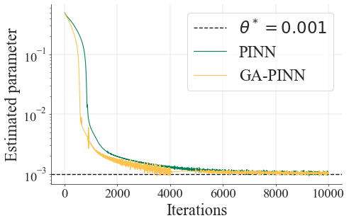
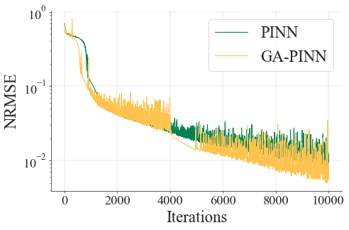
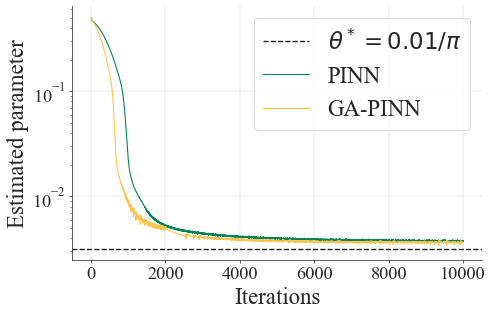
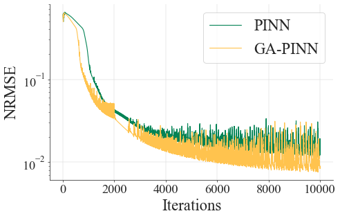
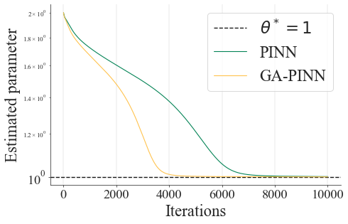
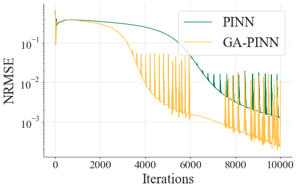

## GA-PINN


### Initial Work:
[Revisiting PINNs: Generative Adversarial Physics-Informed Neural Networks and Point-Weighting Method](https://arxiv.org/abs/2205.08754)

### Current Publication:
[Generative adversarial physics-informed neural networks for solving forward and inverse problem with small labeled samples](https://www.sciencedirect.com/science/article/abs/pii/S089812212500032X)


### Please note:
The observation data is important for PINNs to solve inverse problems. We take the three well-known PDE (Burgers, Allen-Cahn and reaction-diffusion) inverse problems as the examples. The structure of the discriminator should be similar to that of the generator. Especially, the discriminator has half the number of layers as the generator due to the size of labeled samples is small.

## Code

### Requirements:


### Folder tree:
```plaintext
PDE Name/
├── experimental_data # Data from Experimental Results
├── figures # Images Created from Data Derived from Experimental Results
├── main_code
│   ├── method.ipynb
│   └── utils_training.py # Network Architecture Code
├── plot_code 
└── saved_model # Saving the Experimental Result Model
```

### Experimental results:
| PDE Name    | Curves of estimated parameter      | Curves of  NRMSE                       |
|-------------|--------------------------------------|--------------------------------------|
| Allen-Cahn |  |  |
| Burgers    |  |  |
| reaction-diffusion  |  |  |


## Thanks.
If this code repository is helpful to you, please cite the reference:
```plaintext
@article{li2025generative,
  title={Generative adversarial physics-informed neural networks for solving forward and inverse problem with small labeled samples},
  author={Li, Wensheng and Wang, Chuncheng and Guan, Hanting and Wang, Jian and Yang, Jie and Zhang, Chao and Tao, Dacheng},
  journal={Computers \& Mathematics with Applications},
  volume={183},
  pages={98--120},
  year={2025},
  publisher={Elsevier}
}
```